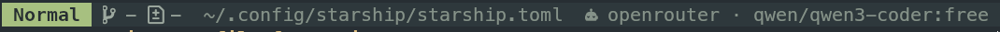

<p align="center">
  
</p>


# asw – Agent Switcher 🧠

## 1. About

`asw` (Agent Switcher) is a lightweight **Fish shell tool** that helps developers quickly switch between multiple AI or API agent configurations — for example, OpenRouter models, local inference endpoints, or private backends.

It provides a **unified interface** to load, save, and cycle through agent profiles, making it ideal for projects that depend on different model providers or tokens.

---

### ⚙️ How It Works

- All agent definitions live inside `~/.config/asw/config.yaml`.
- The active agent is stored in `~/.config/asw/agent`.

Each entry in your YAML file defines a unique agent with a set of connection variables:

```yaml
qwen/qwen3-coder-free:
  AGENT_PROTOCOL: https
  AGENT_URL: https://openrouter.ai/api/v1
  AGENT_KEY: sk-xxxxxxxxxxxxxxxxxxxxxxxxxxxxxxxx
  AGENT_MODEL: qwen/qwen3-coder:free
  AGENT_PROVIDER: openrouter
```

When you switch or load an agent, `asw` performs these steps:

1. Reads the YAML configuration using [`yq`](https://github.com/mikefarah/yq).
2. Loads the corresponding agent data.
3. Exports each property as a **Fish universal variable** (`set -Ux`).

This means that:

- Your active agent settings persist across all Fish sessions.
- They are globally available to your shell, scripts, and Neovim integrations.

---

### 🧩 Universal Variables

`asw` defines the following universal environment variables:

| Variable         | Description                                     |
| ---------------- | ----------------------------------------------- |
| `AGENT_PROTOCOL` | API protocol (e.g. `https`, `http`)             |
| `AGENT_URL`      | Base API URL                                    |
| `AGENT_KEY`      | API key or authentication token                 |
| `AGENT_MODEL`    | Model identifier (e.g. `qwen/qwen3-coder:free`) |
| `AGENT_PROVIDER` | Provider name or source (e.g. `openrouter`)     |

These variables can then be consumed by your scripts, prompts, or LLM client apps.

---

### 🧭 Commands Overview

```fish
asw            # Show current agent
asw next       # Switch to the next agent in config.yaml
asw prev       # Switch to the previous agent
```

When no current agent is found, `asw` automatically loads the **first entry** from your config file.


## 🧭 Installation

### 1. Prerequisites

Make sure you have:

- **Fish shell** installed (version 3.6+ recommended)
- **Fisher** plugin manager
- **yq** (YAML processor)

To check:

```fish
fish --version
fisher --version
yq --version
```

If something’s missing:

```fish
# Install fisher (plugin manager)
curl -sL https://git.io/fisher | source && fisher install jorgebucaran/fisher

# Install yq
sudo dnf install yq    # Fedora / RHEL
# or
sudo apt install yq    # Ubuntu / Debian
# or
brew install yq        # macOS
```

---

### 2. Install `asw` via Fisher

Clone or install directly from your repository (replace with your actual GitHub URL):

```fish
fisher install dshibanov/asw
```

This will install:

- The main command `asw` in `~/.config/fish/functions/asw.fish`
- Default config directory: `~/.config/asw/config.yaml`
- Current agent state file: `~/.config/asw/agent`

---

### 3. Verify Installation

Run:

```fish
asw
```

If everything is correct, you’ll see something like:

```
🐚 AGENT_MODEL=qwen/qwen3-coder:free
   AGENT_PROVIDER=openrouter
   AGENT_URL=https://openrouter.ai/api/v1
   AGENT_PROTOCOL=https
```

---

### 4. Usage

Switch to the next configured agent:

```fish
asw next
```

Switch to the previous agent:

```fish
asw prev
```

Reload the currently saved agent:

```fish
load_asw_agent
```

All agent configuration and environment variables are stored and updated automatically via **universal variables** in Fish (`set -Ux`).


## 🌟 Starship Integration

You can display your current active agent directly in your shell prompt using [Starship](https://starship.rs).

Add the following snippet to your `~/.config/starship.toml`:

```toml
${env_var.AGENT}\

[env_var.AGENT]
symbol = " 󱚥 "
variable = "AGENT_MODEL"
style = "bg:bg_yellow"
format = "[$symbol$env_value ]($style)"


## Integration with sllm.nvim

[`sllm.nvim`](https://github.com/mozanunal/sllm.nvim) is a Neovim plugin for interacting with Large Language Models (LLMs) directly from your editor.  
You can seamlessly integrate it with **asw** to dynamically switch your active LLM provider, model, and key.

### ⚙️ Configuration

Add this to your Neovim config (e.g. `~/.config/nvim/lua/plugins/sllm.lua`):

```lua
return {
  "mozanunal/sllm.nvim",
  config = function()
    require("sllm").setup({
      provider = os.getenv("AGENT_PROVIDER"),
      model = os.getenv("AGENT_MODEL"),
      api_key = os.getenv("AGENT_KEY"),
      endpoint = os.getenv("AGENT_URL"),
    })
  end,
}


## 🧩 CodeCompanion.nvim Integration

[CodeCompanion.nvim](https://github.com/olimorris/codecompanion.nvim) is a Neovim plugin that connects to various AI assistants.  
You can seamlessly use your **asw-managed agent** environment variables with CodeCompanion — no manual token editing needed.

### 🔧 Setup

Add this to your Neovim configuration (for example, in `init.lua` or a CodeCompanion-specific config file):

```lua
-- lazy.nvim plugin spec / codecompanion setup
{
  'olimorris/codecompanion.nvim',
  dependencies = {
    'nvim-lua/plenary.nvim',
    'nvim-treesitter/nvim-treesitter',
  },
  opts = {
    -- plugin options
    opts = {
      log_level = 'DEBUG',  -- keep for diagnostics
    },

    -- Make chat use openrouter by default
    strategies = {
      chat = {
        adapter = "openrouter",
      },
    },

    adapters = {
      http = {
        -- Create an `openrouter` adapter that extends the openai-compatible base.
        -- Use functions so values are read from the environment at runtime.
        openrouter = function()
          -- `openai_compatible` or `openai` extension both work; community uses openai_compatible
          return require("codecompanion.adapters.http").extend("openai_compatible", {
            name = "openrouter", -- shown in UI/logs
            env = {
              -- env values may be strings (var names), cmd:..., or functions
              -- using functions ensures we read the latest $AGENT_* from 'asw' at call time
              url = function() return os.getenv("AGENT_URL") or "https://openrouter.ai/api" end,
              api_key = function() return os.getenv("AGENT_KEY") end,
              -- chat_url is used by some community configs (e.g. /v1/chat/completions)
              chat_url = function() return os.getenv("OPENROUTER_CHAT_URL") or "/v1/chat/completions" end,
            },

            -- Optionally set the default model from asw (runtime function)
            schema = {
              model = {
                default = (function()
                  local m = os.getenv("AGENT_MODEL")
                  if m == nil or m == "" then
                    -- fallback model if AGENT_MODEL is not set
                    return "gpt-4o"
                  end
                  return m
                end)(),
              },
            },

            -- any adapter-specific opts (proxy, streaming, etc) can go here:
            opts = {
              stream = true,
            },
          })
        end,
      },
    },
  },
}
```

This makes CodeCompanion dynamically use whichever agent you’ve currently selected via:

```bash
asw next
# or
asw prev
```

No restart or manual reconfiguration is needed — CodeCompanion will automatically pick up the new environment on the next request.

### 🧠 Example Usage

Switch your active LLM:

```bash
asw next
```

Then in Neovim:

```
:CodeCompanionChat
```

Your chat will now use the agent defined in `~/.config/asw/config.yaml`.

---

### ✅ Optional: Add mini.statusline indicator

<p align="center">
  
</p>


If you use a statusline (e.g. `lualine`), you can show the current active model/provider:

add this to your ../nvim/lua/asw_status.lua

```lua
local M = {}

function M.info()
  local provider = os.getenv 'AGENT_PROVIDER' or '?'
  local model = os.getenv 'AGENT_MODEL' or '?'
  return string.format('%s · %s', provider, model)
end

return M
```


and this one to your lazy-plugins

```lua
return {
  {
    'echasnovski/mini.nvim',
    config = function()
      -- === Core modules ===
      require('mini.ai').setup { n_lines = 500 }
      require('mini.surround').setup()

      -- === Statusline ===
      local ms = require 'mini.statusline'

      ms.setup {
        use_icons = vim.g.have_nerd_font,
        content = {
          active = function()
            local mode, mode_hl = ms.section_mode { trunc_width = 120 }
            local git = ms.section_git { trunc_width = 40 }
            local diff = ms.section_diff { trunc_width = 75 }
            local diagnostics = ms.section_diagnostics { trunc_width = 75 }
            local lsp = ms.section_lsp { trunc_width = 75 }
            local filename = ms.section_filename { trunc_width = 140 }
            local fileinfo = ms.section_fileinfo { trunc_width = 120 }
            local location = ms.section_location { trunc_width = 75 }
            local search = ms.section_searchcount { trunc_width = 75 }

            -- Our custom symbol or info
            local rocket = '󱚥' -- replace later with require('asw_status').info()

            return ms.combine_groups {
              { hl = mode_hl, strings = { mode } },
              { hl = 'MiniStatuslineDevinfo', strings = { git, diff, diagnostics, lsp } },
              '%<', -- Mark truncate point
              { hl = 'MiniStatuslineFilename', strings = { filename } },
              { strings = { rocket } },
              '%=', -- End left alignment (everything after this is right-aligned)
              { hl = 'MiniStatuslineFileinfo', strings = { fileinfo } },
              { hl = mode_hl, strings = { search, location } },
            }
          end,
        },
      }

      -- Optional: tweak how line/col are displayed
      ms.section_location = function()
        return '%2l|%2v'
      end
    end,
  },
}
```

